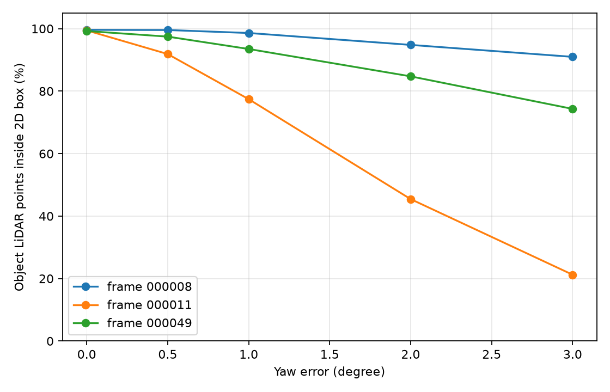
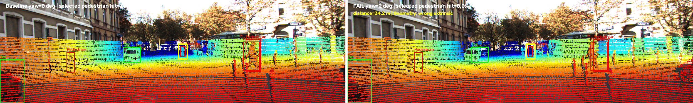

# Báo cáo Day 6: Độ nhạy của LiDAR-camera projection với lệch yaw

- **Họ tên:** Phạm Thị Ngọc Anh
- **MSSV:** 2A202602831
- **Lớp:** Track 4
- **Link repo:**https://github.com/ngocanhpham-hust/PhamThiNgocAnh-2A202602831-Track4-Day06.git
- **Topic:** A — Kiểm tra calibration LiDAR-camera
- **Dataset:** data/synthetic, data/kitti_mini, data/nuscenes_mini_subset
- **Các frame đã dùng:** 000000, 000004, 000008, 000011, 000019, 000049, scene-0103_010

## 1. Claim

Trên frame KITTI 000011 có nhiều người đi bộ, lệch yaw 1° làm tỉ lệ điểm LiDAR của vật thể
rơi đúng vào 2D box giảm hơn 20 điểm phần trăm; trong khi frame 000008 có nhiều xe giảm dưới
2 điểm phần trăm. Vì vậy vật thể hẹp làm lộ calibration drift rõ hơn vật thể rộng.

## 2. Evidence

| Yaw (độ) | Frame 000008 (đông xe) | Frame 000011 (nhiều người) | Frame 000049 (che khuất) |
|---:|---:|---:|---:|
| 0.0 | 99.63% | 99.45% | 99.25% |
| 0.5 | 99.57% | 91.88% | 97.46% |
| 1.0 | 98.62% | 77.44% | 93.50% |
| 2.0 | 94.81% | 45.44% | 84.74% |
| 3.0 | 90.98% | 21.23% | 74.32% |



Ở 1°, frame 000011 giảm 22.01 điểm phần trăm, còn frame 000008 chỉ giảm 1.01 điểm.
Phân tích mở rộng theo class trong `results/yaw_perturb_objects.csv` cho thấy Pedestrian giảm từ
96.72% xuống 78.45% ở 1°, còn Car giảm từ 99.76% xuống 97.14%.


## 3. Failure case



- **Trường hợp:** frame 000011, người đi bộ `object_id=3` ở 34.2 m, yaw bị lệch 2°.
- **Quan sát:** hit ratio của vật thể này giảm từ 100.0% xuống 0.0%; box chỉ rộng 15.3 pixel.
- **Nguyên nhân:** với tiêu cự khoảng 721.5 px, lệch 2° gây trượt xấp xỉ `721.5*tan(2°)=25.2 px`, lớn hơn chiều rộng box.
- **Lớp debug:** Geometry — extrinsic `Tr_velo_to_cam` không còn đúng.
- **Cách phát hiện khi chạy thật:** log hit ratio theo class; cảnh báo khi Pedestrian dưới 90% trong nhiều cửa sổ liên tiếp và chỉ đánh giá khi đủ điểm vật thể.

## 4. Khuyến nghị nếu triển khai thật

- **Use-case:** xe giao hàng tự hành trong đô thị, dùng LiDAR-camera để phát hiện người đi bộ.
- **Triển khai:** tính hit ratio theo class khi xe dừng hoặc theo cửa sổ một phút; ngưỡng Pedestrian 90% bắt được mức lệch khoảng 1° trong thí nghiệm này. Yêu cầu nhiều cửa sổ liên tiếp để tránh báo động do ít điểm/che khuất.
- **Trade-off và log:** kiểm tra mỗi frame phát hiện sớm nhưng tốn CPU và phụ thuộc label/detector; cần log hit ratio, số điểm dùng để tính, khoảng cách, class, tốc độ xe, timestamp hai cảm biến và nhiệt độ/va chạm của gá cảm biến.

## 5. Cách chạy lại

Chạy từ thư mục gốc repo trên macOS/Linux:

```bash
python3 -m venv .venv
source .venv/bin/activate
python -m pip install -r requirements.txt
python tools/verify_data.py --data-root data/kitti_mini
python tools/verify_data.py --data-root data/nuscenes_mini_subset
python -m src.test_projection
python -m starter.projection --data-root data/kitti_mini --frame 000019
python -m starter.projection --data-root data/kitti_mini --frame 000011
python -m starter.projection --data-root data/kitti_mini --frame 000004
python -m src.exp_yaw_sweep
python -m src.plot_yaw_sweep
python -m src.make_failure_case
python tools/check_submission.py
```

`src.exp_yaw_sweep` có pipeline xác định, không dùng phép ngẫu nhiên; lần chạy kiểm tra thứ hai tạo hai CSV
giống byte-for-byte với lần đầu. Các script đều có `--help` và giá trị mặc định chạy được ngay.

## 6. Khai báo sử dụng AI

| Công cụ | Dùng cho việc gì | Bạn đã kiểm chứng thế nào |
|---|---|---|
| OpenAI Codex | Cài đặt hai hàm projection, viết self-test, script yaw sweep/plot/failure và soạn nháp báo cáo | Chạy `src.test_projection`; đối chiếu đủ 15 hit ratio với bảng chuẩn; xem trực tiếp ảnh overlay/failure; rerun hai CSV giống byte-for-byte |
| Codelab Day 6 | Dùng script yaw sweep mẫu làm điểm xuất phát | Mở rộng thêm CSV từng vật thể, phân tích class/khoảng cách, CLI và ảnh failure; kiểm tra lại số chuẩn trước khi phân tích |

Tôi chịu trách nhiệm đọc, hiểu và có thể giải thích các hàm `velo_to_cam`, `cam_to_image`,
`points_in_box`, cách tính `hit_ratio`, cũng như mọi con số nêu trong báo cáo.
